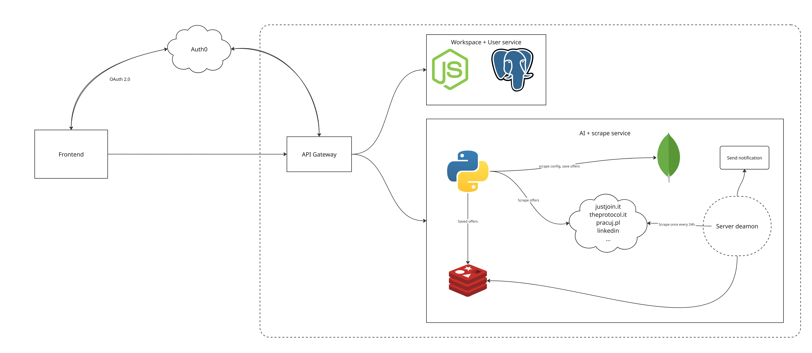
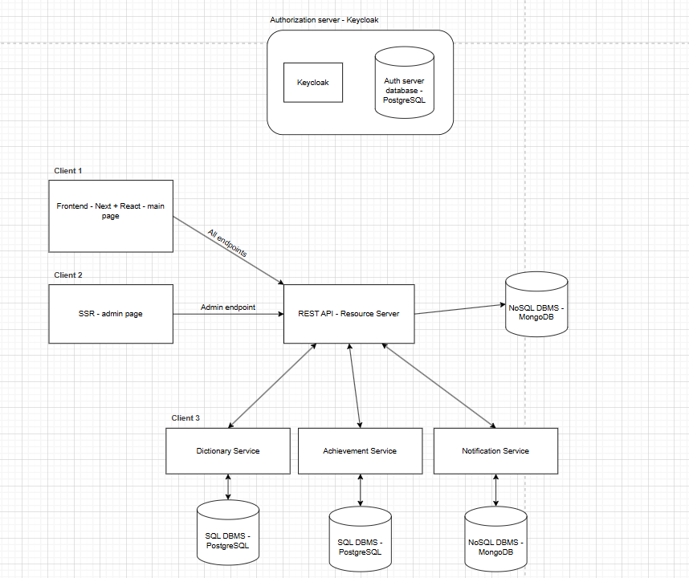

<h1>Hi 👋, I'm Antoni</h1>

🔥 Computer Science student 🔥

 📈Full stack, backend engineer

 🎵I believe that computer science is not a music theory 🎵

<h2>Frontend Stack</h2>

  

<h2>Backend Stack</h2>

  

<h2>Other tools</h2>

  

## Projects - showcase

<table>
  <tr>
    <td align="center" width="33%">
      
       
      <b>JobMatch.AI</b> 
      Built an AI-powered platform for creating recruitment documents. 
      🔗 <a href="https://github.com/forbiddenrng/projekt-zespolowy/blob/develop/README.md">Repo</a>
       
      Tags: AI, Scrape, Job Search
    </td>
    <td align="center" width="33%">
      
       
      <b>Wordle Game</b> 
      Worlde game with microservices deployed in Docker and Kubernetes. 
      🔗 <a href="https://github.com/forbiddenrng/projekt_wordle/blob/master/README.md">Repo</a>
       
      Tags: Fullstack, DevOps, Docker
    </td>
    <td align="center" width="33%">
      
       
      <b>Election emotions analysis </b> 
      Analysed emotions and content in tweets about two candidates in 2025 elections 
      🔗 <a href="https://github.com/forbiddenrng/projekt-io/blob/master/Projekt_IO.pdf">Repo</a>
       
      Tags: Scrape, AI, Hugging Face, ML
    </td>
  </tr>
</table>

<h2>⚡️ Where to find me</h2>

